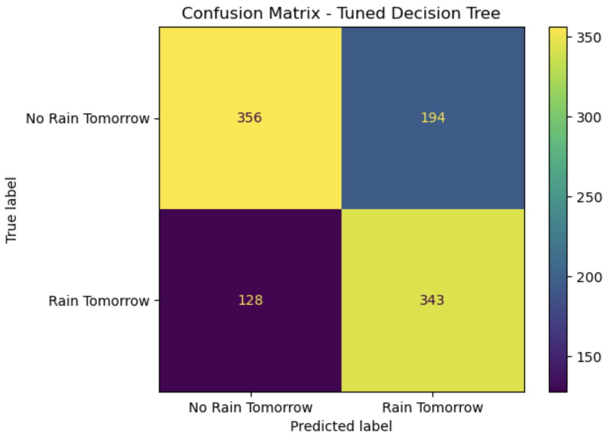
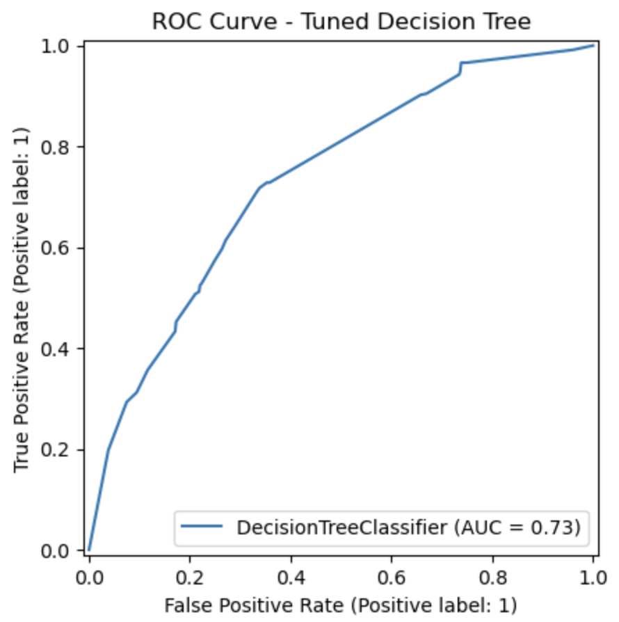
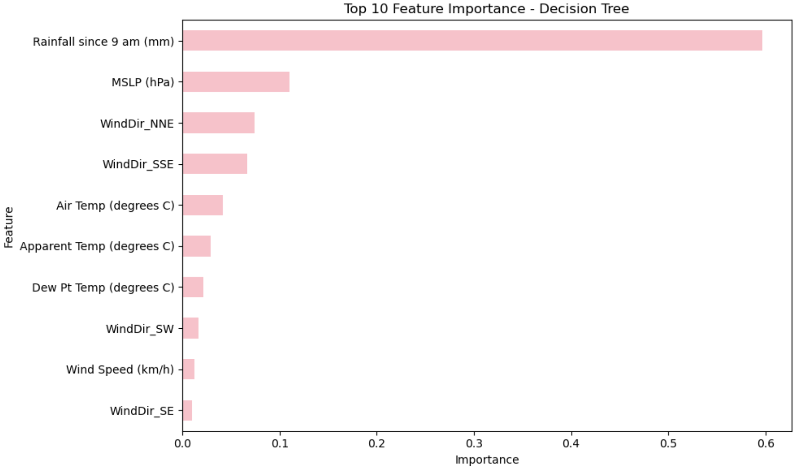

# 🌦️ Melbourne Climate Analysis & Rainfall Prediction

A data science project analysing Melbourne climate data and predicting next-day rainfall using a Decision Tree classifier.

## 📌 Project Overview

This project was originally developed as part of the ADS2001 team project at Monash University. The project explored Melbourne climate data, including temperature, humidity, wind, atmospheric pressure, and rainfall observations, with the aim of analysing weather patterns and developing models for rainfall prediction.

This repository focuses on my individual contribution to the project: developing and evaluating a Decision Tree model for next-day rainfall prediction.

## 🎯 My Contribution

My main contribution focused on the rainfall classification component:

- Developed a **Decision Tree classifier** to predict whether it would rain on the following day.
- Prepared the prediction target and selected relevant weather features for modelling.
- Used a **chronological train-test split** to better reflect real-world forecasting.
- Applied **TimeSeriesSplit** and **GridSearchCV** for model tuning.
- Evaluated the model using **accuracy, precision, recall, F1-score, and ROC-AUC**.
- Adjusted the classification threshold to improve the detection of rainy days.
- Analysed **feature importance** to better understand the variables influencing the model's predictions.

## 🔄 Modelling Workflow

`Climate Data` → `Data Preparation` → `RainTomorrow Target` → `Time-Based Split` → `Decision Tree` → `Model Tuning` → `Threshold Selection` → `Evaluation`

## 📊 Model Performance

The refined Decision Tree model achieved:

| Metric | Score |
|---|---:|
| Accuracy | 0.685 |
| Precision | 0.639 |
| Recall | 0.728 |
| F1-score | 0.681 |
| ROC-AUC | 0.735 |

The classification threshold was adjusted to **0.31** using training-set out-of-fold predictions. This improved recall for rainy days, allowing the model to identify a larger proportion of actual rainfall events, with a trade-off in precision.

## 📈 Results & Visualisations

### Confusion Matrix

  

The tuned Decision Tree correctly identified **343 of 471 rainy days**, corresponding to a recall of approximately **72.8%**. The model missed 128 rainy days and produced 194 false-positive rainfall predictions.

### ROC Curve

  

The tuned Decision Tree achieved a ROC-AUC of **0.735**, indicating a moderate ability to distinguish between rainy and non-rainy days.

### Feature Importance

  

The model relied most heavily on **rainfall since 9 am**, followed by **mean sea level pressure (MSLP)**, wind direction, and temperature-related variables.

Feature importance indicates which variables were most influential in the Decision Tree's predictions and should not be interpreted as evidence of causal relationships.

## 🛠️ Technologies

- **Python**
- **Pandas**
- **NumPy**
- **scikit-learn**
- **Matplotlib**
- **Jupyter Notebook**

## 📁 Repository Contents

- [`rainfall_prediction_decision_tree.ipynb`](rainfall_prediction_decision_tree.ipynb) — Decision Tree modelling, tuning, evaluation, and interpretation.

## 📝 Project Note

This was originally a team project completed for **ADS2001 at Monash University**. This repository highlights my individual contribution to the rainfall prediction component. The modelling workflow was subsequently refined for this portfolio, including time-aware validation, hyperparameter tuning, and classification threshold selection.
